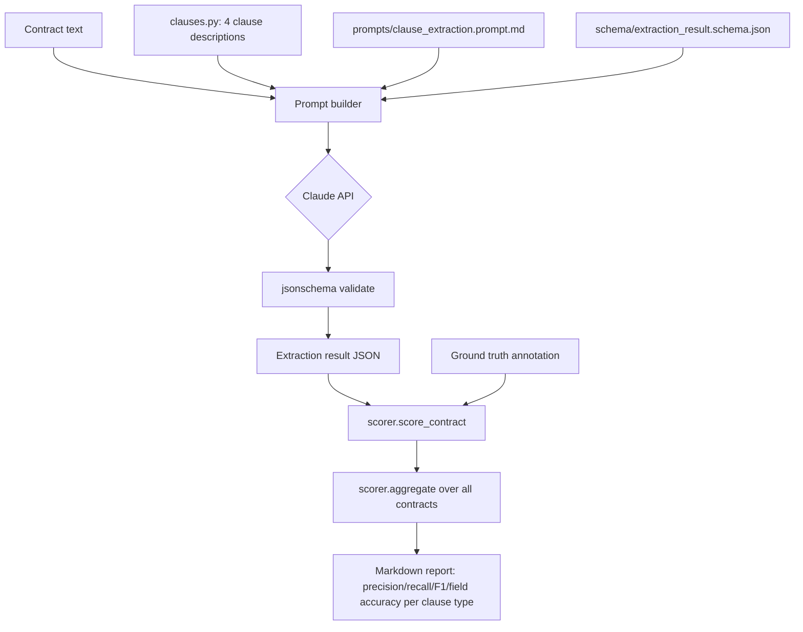

# Architecture

## Pipeline overview

One model call per contract extracts all 4 clause types at once, rather than one call per clause type. This mirrors how a person actually reads a contract (once, noting everything relevant), and keeps benchmark cost to one call per document instead of four.

## Components

| Module | Responsibility |
|---|---|
| `qtc_clause_bench/__init__.py` | Package version and the canonical `CLAUSE_TYPES` list. |
| `qtc_clause_bench/clauses.py` | Human-readable definitions of the 4 clause types, used in the prompt and in documentation, defined once. |
| `qtc_clause_bench/dataset.py` | Loads contract/annotation pairs from `data/`, and enforces that every contract has exactly one matching annotation (fails loudly on any mismatch, see [Design decisions](#design-decisions)). |
| `qtc_clause_bench/engine.py` | Prompt building, the model call, JSON parsing, schema validation. `_call_model` is the only function that imports the `anthropic` package. |
| `qtc_clause_bench/scorer.py` | Presence-confusion scoring (TP/FP/FN/TN per clause type) and field-level exact-match accuracy on true positives. Pure functions, no I/O, easy to unit test independent of any model call. |
| `qtc_clause_bench/cli.py` | `extract` (single contract) and `benchmark` (full dataset + report) subcommands. |
| `data/contracts/*.txt` | 12 synthetic MSA, SOW, and Order Form documents. See [Dataset construction](#dataset-construction). |
| `data/annotations/*.json` | Hand-authored ground truth, one per contract, validated against `schema/extraction_result.schema.json`. |
| `prompts/clause_extraction.prompt.md` | The single prompt template, filled by simple string replacement (`engine._render`), no templating engine dependency. |
| `schema/extraction_result.schema.json` | JSON Schema (draft-07). One schema serves three roles: the contract for the model's output, the validation target for every ground-truth annotation, and the documentation of the taxonomy's structured fields. |

## Dataset construction

12 contracts, fictional companies, no real client or employer data. Built as a mix of:

- **Clean positives** (c001, c002, c003, c004, c007, c011, c012): textbook examples of one or more clause types, used to check the pipeline gets the easy cases right before trusting it on anything harder.
- **True negatives** (c001's `msa_sow_linkage`, c005's `pricing_tier`/`discount_threshold`, c008 entirely, c009's `renewal_term`): clause types that are genuinely absent. Necessary because a benchmark with only positive examples can't detect a pipeline that hallucinates clauses into every document, precision can only be measured where there's a real chance of a false positive.
- **Edge cases** (c005/c006 evergreen and perpetual terms, c009's "terminate automatically" phrasing that isn't an auto-renewal, c010's two-agreement distractor, c006's incomplete MSA reference): each targets a specific failure mode a naive keyword-matching or overconfident extractor would hit. Every edge case has an `annotation_note` in its ground truth file explaining the reasoning, read those before adding similar cases.

`tests/test_dataset.py::test_dataset_has_at_least_one_true_negative_per_clause_type` and its positive-example counterpart enforce that the dataset can never regress into all-positive or all-negative for any clause type, that would silently break precision or recall for that type.

**Known limitation**: 12 contracts is enough to validate the pipeline and scorer logic, not enough to make a statistically confident claim about real-world accuracy. Precision/recall on n=12 with maybe 3-5 positives per clause type means a single wrong extraction swings the metric by double-digit percentage points. Treat early benchmark numbers as directional, and treat growing this dataset as the highest-value contribution someone can make (see [CONTRIBUTING.md](../CONTRIBUTING.md)).

## Scoring methodology

Two questions, kept deliberately separate rather than blended into one score:

1. **Presence classification** (`precision`, `recall`, `f1`, `presence_accuracy`): standard confusion-matrix metrics treating "clause present" as the positive class, computed per clause type across the whole dataset.
2. **Field accuracy**: computed only on true positives (where both the pipeline and ground truth agree the clause is present), using exact match on the clause type's key fields. See `qtc_clause_bench/scorer.py`'s `FIELD_MATCHERS` for the exact fields compared per clause type.

**Why exact match instead of fuzzy or numeric-tolerance matching.** A discount percentage, a notice-period day count, or a tier's unit price is either right or it's the wrong number a quote-to-cash system would then bill against. There's no "close enough" for a number that flows into an invoice. If practical use later shows a genuine need for tolerance (e.g., rounding a $9,999.99 tier boundary to $10,000), add it explicitly and document why, don't loosen the comparison silently.

**Why field accuracy is reported separately from presence accuracy, not multiplied together.** A single blended score hides which failure mode is happening. A pipeline with perfect presence detection and poor field extraction has a completely different fix (better structured-output prompting) than one that misses half the clauses entirely (better clause-boundary detection or retrieval). Keeping the numbers apart keeps the report diagnostic, not just a leaderboard entry.

## Design decisions

**Why `dataset.list_contract_ids()` raises instead of silently skipping mismatched files.** A contract with no annotation, or an annotation with no contract, is a broken benchmark example, not a soft warning. Failing loudly at load time (rather than at scoring time, or worse, silently dropping the example) means a broken pair is caught the moment someone runs the tests, not discovered later as an unexplained gap in a report.

**Why one call extracts all 4 clause types instead of 4 separate calls.** Cost and realism, see [Pipeline overview](#pipeline-overview). The tradeoff: a single malformed JSON response invalidates the whole contract's result rather than just one clause type. `cli.py`'s `benchmark` command handles this by excluding the failed contract from the report and printing why, rather than silently zero-filling it.

**Why there's no retrieval or chunking step.** These are single documents, a few hundred to a thousand words each, well within context window limits, so the full text goes in the prompt directly. A real quote-to-cash document set (hundreds of MSAs and SOWs, some scanned, some long) would need a chunking and retrieval layer before this approach scales; that's a natural v2, not something this benchmark's synthetic dataset currently needs.

## Extensibility

**Adding a 5th clause type.** Add its description to `qtc_clause_bench/clauses.py::CLAUSE_DESCRIPTIONS`, its object schema to `schema/extraction_result.schema.json`, a field matcher function to `qtc_clause_bench/scorer.py::FIELD_MATCHERS`, and at least 3 contracts (a clean positive, a true negative, an edge case) per [CONTRIBUTING.md](../CONTRIBUTING.md). `payment_terms` (net-30/45/60, late-payment interest) and `termination_for_convenience` are the natural next candidates.

**Swapping the model provider.** Replace `engine._call_model`. Keep its `(prompt, model, temperature) -> str` signature so `engine.extract` doesn't need to change.

**Adding a retry-with-repair loop.** Currently, a schema validation failure raises `SchemaError` and the CLI excludes that contract from the benchmark report. A natural improvement: on failure, send the invalid output back to the model with the validation error and ask it to fix it, retry once before giving up. Good first contribution.

**Chunking for long documents.** If someone wants to point this at real (properly anonymized, permission-cleared) long-form contracts rather than the synthetic dataset, `engine.build_extraction_prompt` is the one function that would need a chunking strategy in front of it; the schema and scorer don't need to change.

## Known gaps

- No retry/repair loop on schema validation failure (see above).
- `quote_span` is never checked against the source contract text for actual grounding, a model could return a plausible-sounding but fabricated quote and nothing in the current pipeline would catch it. Adding a substring or fuzzy-match check against the source document is a good next contribution.
- Dataset size (12 contracts) is enough to exercise the pipeline and scorer, not enough for a statistically confident accuracy claim, see [Dataset construction](#dataset-construction).
- No results published yet in `results/`, this build environment has no live Anthropic API credentials. See the README's [Results](../README.md#results) section.

